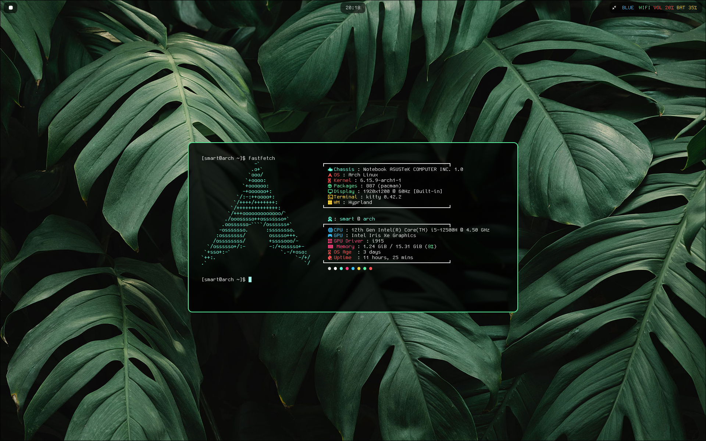
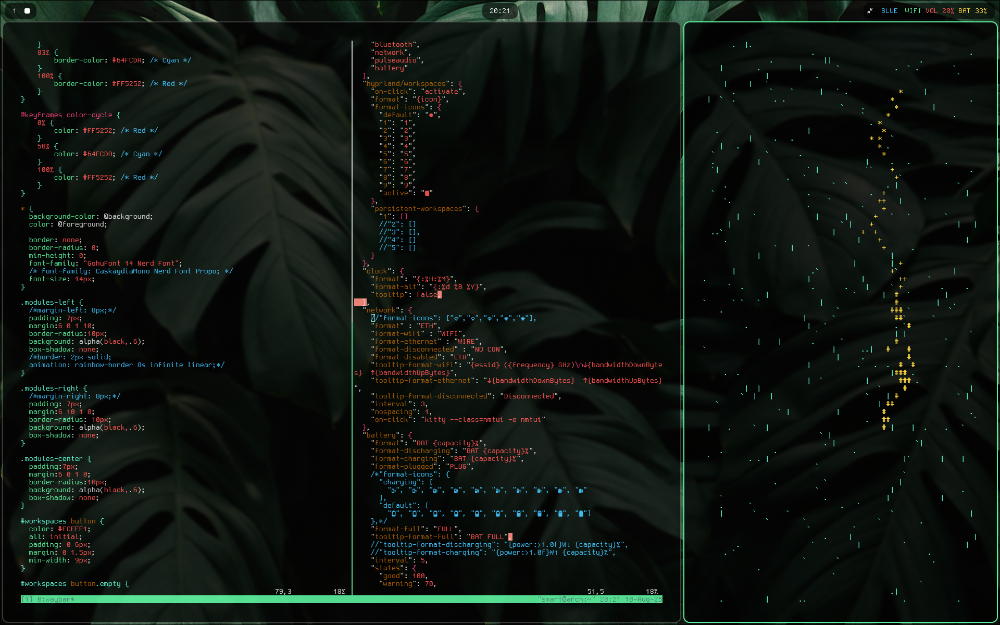

SHOWCASES

---

---

#Waybar

##Tray

tray icon is hiding in expand

##Bluetooth

Left click to open bluetui
Right click on BLUE to toggle on/off

| color | mean |
|---|---|
| white | on but not connect |
| blue | conected bluetooth |
| gray | bluetooth off |

##Network

Left click to open nmtui

| format | color | mean |
|---|---|---|
| ETH | gray | hardware off |
| NO CON | red | no connect |
| WIFI | green | connected wifi |
| WIRE | rainbow | connected wire |

##Volume

Left click to open wiremix

color is rainbow check out in /waybar/config.jsonc

##Battery

| format | color | mean |
|---|---|---|
| percentage | green | 70%-100% |
| percentage | yellow | 20%-70% |
| percentage | red | 0%-20% |
| percentage | rainbow | charging |
| PLUG | rainbow | plugged |
